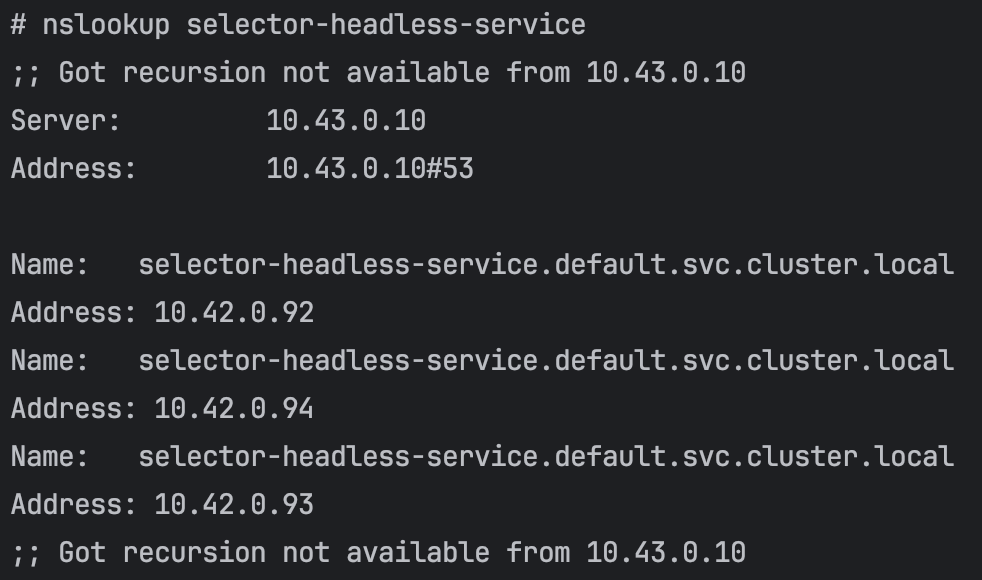

## Headless가 필요한 이유?
우선 로드밸런싱이 무엇인지에 대해 다시 살펴보자
로드밸런싱이란 서버에 가해지는 부하 적절히 분산시키는 기술을 말하는데, 쿠버네티스의 경우 네트워크 트래픽을 여러 서버에 적절히 분산시켜 전달하는 기능을 말한다
즉 내가 보낸 요청이 동일한 3대의 파드 중 하나에 전달된다는 것이다

그러나 때론 로드밸런싱이 필요하지 않을 때도 있다
예시야 여러가지 이겠지만, 서비스가 관리하는 파드 집합 중 특정 파드들에게 요청을 보내고 싶다면?
이때는 무조건 랜덤한 하나의 파드에 요청을 보내는 정상 서비스로는 불가능하다
물론 API를 사용해서 구현해낼 수 있긴하다. 하지만 같은 상황일 때 API 구현을 고민해야하는 일이 벌어진다
여기 그런 쿠버네티스의 구현에 얽매이지 않고 살짝 속성을 바꿔서 간단하게 처리하는 방법이 있다
그것이 바로 Headless Service 이다!

---
## Headless Service 란?
Headless란 머리가 없는, 즉 방향이 없는 서비스를 말한다. 즉 Cluster IP가 부여되지 않은 서비스라는 뜻이다
그럼 IP가 부여되지 않은 서비스는 과연 어떻게 동작하게 될까? 이를 한번 살펴보자

---
## 가상 IP가 부여되지 않았다면?
우선 노드 내에는 DNS 시스템과 프록시가 존재한다
DNS 시스템은 도메인 네임을 질의 시에 그에 맞는 IP 주소를 반환하는 역할을, 프록시는 내부로 요청을 전달하거나 외부로 요청을 보내는 역할을 한다

* 프록시 무시
일반적이라면 서비스 간 통신은 프록시 통해 요청을 주고 받는다. 이는 결국 서비스가 IP를 가져야 가능한 것인데, 이것이 없는 순간 서비스는 프록시의 처리 대상에서 제외된다

* 로드밸런싱 불가
프록시가 서비스를 처리하지 않기 때문에 로드 밸런싱 기능도 당연히 불가능하다

* DNS 검색을 통한 직접 소통
IP가 사라졌기에 서비스 검색은 DNS 만이 유일하다
즉 대상 서비스의 파드들과 통신하기 위해선, DNS 질의를 통해 관리 파드들의 주소를 얻어내어 직접 소통하는 방법뿐이다

위와 같은 이유로 헤드리스 서비스를 사용하게 되면 관리하고 있는 특정 파드들과 직접 통신할 수 있게 된다

---
## 실습
그럼 이제 확실히 이해했으니, 어떻게 특정 파드들을 얻을 수 있는지 확인해보자

### StatefulSet 관리 서비스(Selector 존재)
스테이트풀 셋의 경우, 해당되는 파드들은 각각 subdomain 형식으로 도메인이 정해진다
가령 아래와 같이 스테이트풀 셋을 관리하는 헤드리스 서비스를 생성한다면,
서비스와 하위 파드들의 도메인 이름은 각각 다음과 같이 배정된다

// Service 도메인

// 파드들 도메인

---
### 디플로이먼트 관리 서비스
또는 그냥 디플로이먼트 오브젝트를 관리하는 서비스의 경우, 각 파드엔 hostname, subdomain가 없다
따라서 DNS로 파드만 따로 조회할 수는 없고 관리하는 전체 파드들의 주소를 알 수 있다
서비스를 도메인 이름으로 조회하면

위처럼 하위 모든 파드들의 IP 주소를 반환한다
